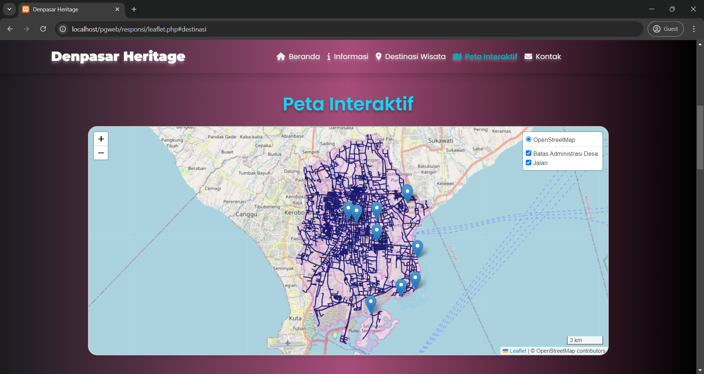
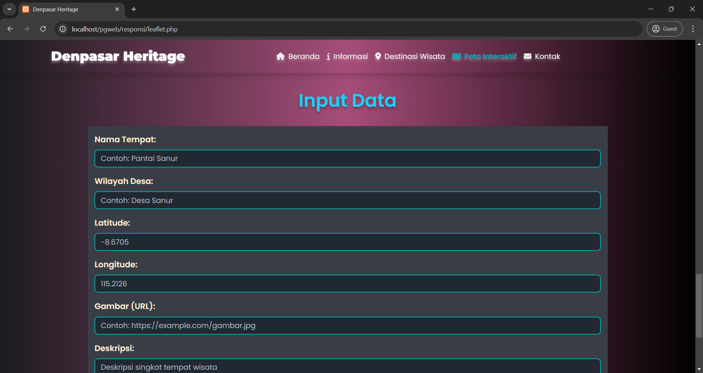
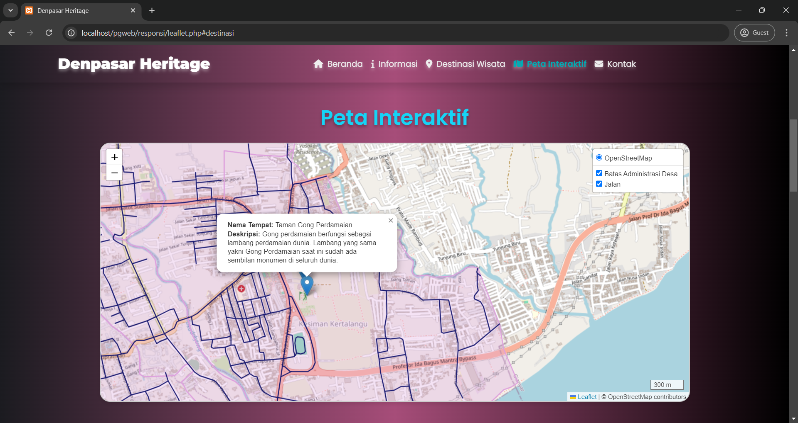

# Denpasar Heritage

## Table of Contents

- [Nama Produk](#nama-produk)
- [Deskripsi Produk](#deskripsi-produk)
- [Komponen Pembangun Produk](#komponen-pembangun-produk)
- [Sumber Data](#sumber-data)
- [Tangkapan Layar](#tangkapan-layar)
- [Installation](#installation)
  - [Prerequisites](#prerequisites)
  - [Setup Steps](#setup-steps)
- [Usage](#usage)
- [Contributing](#contributing)
- [License](#license)
- [Contact](#contact)

## Nama Produk

**Denpasar Heritage**

## Deskripsi Produk

Denpasar Heritage adalah aplikasi web interaktif yang dirancang untuk menampilkan berbagai destinasi wisata budaya di Denpasar, Bali. Menggunakan **Leaflet.js** untuk peta interaktif, **PHP** dan **MySQL** untuk operasi backend, serta **SweetAlert2** untuk interaksi pengguna yang ditingkatkan, aplikasi ini memungkinkan pengguna untuk melihat, menambah, mengedit, dan menghapus data wisata dengan mudah. Selain itu, aplikasi ini mengintegrasikan lapisan GeoJSON untuk menampilkan jalan dan batas administrasi desa, memberikan konteks geografis yang komprehensif.

## Komponen Pembangun Produk

### Frontend

- **HTML5**: Struktur dasar halaman web.
- **CSS3**:
  - **Bootstrap 5**: Framework CSS untuk desain responsif dan komponen UI.
  - **Animate.css**: Untuk animasi elemen web.
- **JavaScript**:
  - **Leaflet.js**: Library untuk peta interaktif.
  - **SweetAlert2**: Untuk notifikasi dan dialog yang lebih menarik.
  
### Backend

- **PHP**: Bahasa pemrograman server-side untuk menangani CRUD (Create, Read, Update, Delete) operasi.
- **MySQL**: Database untuk menyimpan data destinasi wisata.
  
### Tools dan Libraries Lainnya

- **XAMPP**: Untuk lingkungan pengembangan lokal dengan Apache dan MySQL.
- **Font Awesome**: Ikon untuk elemen UI.
- **GeoJSON**: Format data untuk menampilkan jalan dan batas administrasi desa di peta.

## Sumber Data

1. **Database MySQL**:
   - **Responsi**: Database utama yang menyimpan informasi destinasi wisata.
   - **Table `destinasi_wisata`**:
     - `id`: ID unik destinasi.
     - `nama_tempat`: Nama destinasi.
     - `wilayah_desa`: Wilayah desa tempat destinasi berada.
     - `latitude`: Koordinat latitude destinasi.
     - `longitude`: Koordinat longitude destinasi.
     - `gambar`: URL gambar destinasi.
     - `deskripsi`: Deskripsi singkat destinasi.
   
2. **GeoJSON Files**:
   - **JALAN_LN_25K.geojson**: Menampilkan jaringan jalan di Denpasar.
   - **ADMINISTRASIDESA_AR.geojson**: Menampilkan batas administrasi desa di Denpasar.

## Tangkapan Layar

### 1. Halaman Utama WEB GIS


### 2. Halaman Utama dengan Peta Interaktif



### 3. Daftar Destinasi Wisata


### 4. Formulir Input Data




### 5. Tabel Data Wisata


### 6. Popup Marker dengan Informasi Destinasi



## Installation

### Prerequisites

Sebelum memulai, pastikan Anda telah menginstal hal-hal berikut:

- **XAMPP**: Untuk menjalankan server lokal dengan Apache dan MySQL. [Download XAMPP](https://www.apachefriends.org/index.html)
- **Web Browser**: Seperti Google Chrome, Firefox, atau Safari.

### Setup Steps

1. **Clone the Repository:**

   ```bash
   git clone https://github.com/yourusername/denpasar-heritage.git
   ```

2. **Place the Project in XAMPP's `htdocs`:**

   Pindahkan folder `denpasar-heritage` ke direktori `C:\xampp\htdocs\` (Windows) atau `/Applications/XAMPP/htdocs/` (macOS).

3. **Start Apache and MySQL:**

   Buka XAMPP Control Panel dan jalankan modul **Apache** dan **MySQL**.

4. **Create the Database:**

   - Buka [phpMyAdmin](http://localhost/phpmyadmin/).
   - Klik **"New"** untuk membuat database baru.
   - Nama database: `responsi`.
   - Klik **"Create"**.

5. **Import the Database Schema:**

   - Klik pada database `responsi` yang baru dibuat.
   - Buka tab **"Import"**.
   - Pilih file `database.sql` yang disediakan dan klik **"Go"**.

6. **Configure Database Connection:**

   Pastikan kredensial database di file PHP (`delete.php`, `edit.php`, `input.php`, dan `leaflet.php`) sesuai dengan pengaturan MySQL Anda. Secara default, XAMPP menggunakan:

   - **Host:** `localhost`
   - **Username:** `root`
   - **Password:** *(kosong)*

   Contoh konfigurasi di `delete.php`:

   ```php
   $servername = "localhost";
   $username = "root";
   $password = "";
   $dbname = "responsi";
   ```

7. **Add GeoJSON Data:**

   - Tempatkan file GeoJSON (`JALAN_LN_25K.geojson` dan `ADMINISTRASIDESA_AR.geojson`) di direktori berikut:

     ```
     C:\xampp\htdocs\pgweb\responsi\data\KOTA DENPASAR\KOTA DENPASAR\
     ```

8. **Add Icon Assets:**

   - Pastikan ikon `point.jpg` ditempatkan di direktori `images/icons/`:

     ```
     responsi/images/icons/point.jpg
     ```

9. **Access the Application:**

   Buka web browser dan navigasikan ke:

   ```
   http://localhost/pgweb/responsi/leaflet.php
   ```

## Usage

### Accessing the Application

Setelah mengikuti langkah-langkah instalasi, akses aplikasi melalui browser Anda:

```
http://localhost/pgweb/responsi/leaflet.php
```

### Application Functionalities

- **Viewing Destinations:**
  - Jelajahi daftar destinasi wisata yang ditampilkan dalam sesi scroll horizontal.
  - Klik tombol **"Lihat Lokasi"** untuk memindahkan peta ke lokasi destinasi dan menampilkan popup informasi.

- **Interactive Map:**
  - Eksplorasi peta interaktif dengan marker yang mewakili setiap destinasi.
  - Toggle layer GeoJSON untuk jalan dan batas administrasi desa melalui panel kontrol layer.

- **Adding a New Destination:**
  - Isi formulir **"Input Data"** dengan detail destinasi wisata.
  - Klik **"Submit"** untuk menambahkan destinasi baru ke database dan memperbarui peta.

- **Editing a Destination:**
  - Klik tombol **"Edit"** pada tabel **"Data Wisata"** untuk mengisi formulir dengan data yang ada.
  - Perbarui field yang diinginkan dan submit untuk menyimpan perubahan.

- **Deleting a Destination:**
  - Klik tombol **"Hapus"** pada tabel **"Data Wisata"**.
  - Konfirmasi penghapusan melalui SweetAlert2 untuk menghapus destinasi dari database dan memperbarui peta.

## Contributing

Kontribusi sangat diterima! Ikuti langkah-langkah berikut untuk berkontribusi pada proyek ini:

1. **Fork the Repository:**

   Klik tombol **Fork** di sudut kanan atas halaman repository.

2. **Clone Your Fork:**

   ```bash
   git clone https://github.com/yourusername/denpasar-heritage.git
   ```

3. **Create a New Branch:**

   ```bash
   git checkout -b feature/your-feature-name
   ```

4. **Make Your Changes:**

   Implementasikan fitur atau perbaikan bug yang diinginkan.

5. **Commit Your Changes:**

   ```bash
   git commit -m "Add feature: your feature description"
   ```

6. **Push to Your Fork:**

   ```bash
   git push origin feature/your-feature-name
   ```

7. **Create a Pull Request:**

   Navigasikan ke repository asli dan klik **New Pull Request**.

## License

Distributed under the [MIT License](LICENSE).

## Contact

Untuk pertanyaan atau dukungan, silakan hubungi:

- **Nama:** Muhammad Fauzil Adhim Sulistyo
- **Email:** zilzilfauzil@gmail.com
- **GitHub:** [fauziiladhim1](https://github.com/fauziiladhim1)
- **LinkedIn:** [MUHAMMAD FAUZIL ADHIM SULISTYO](https://www.linkedin.com/in/fauziiladhim)

---

© 2024 Denpasar Heritage. All rights reserved.

---

## Additional Notes

- **Security:** Pastikan skrip PHP Anda (`delete.php`, `edit.php`, `input.php`) aman dan menangani input pengguna dengan benar untuk mencegah SQL Injection dan kerentanan keamanan lainnya.
- **Backup:** Secara teratur backup database Anda untuk mencegah kehilangan data.
- **Performance:** Optimalkan file GeoJSON untuk meningkatkan performa peta, terutama jika file tersebut besar.
- **Customization:** Anda dapat menyesuaikan gaya, marker peta, dan elemen UI lainnya untuk lebih sesuai dengan branding dan tujuan pengalaman pengguna proyek Anda.

---

**Happy Mapping!**